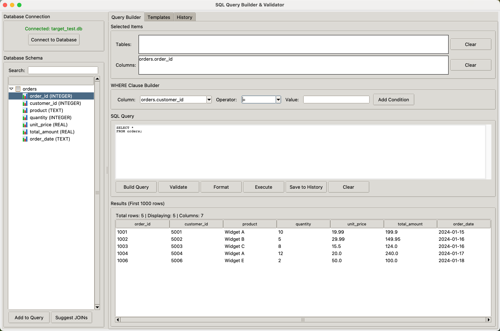

# 🗄️ SQL Query Builder & Validator


> **A comprehensive desktop application for visual SQL query construction and database management** - Build, validate, and execute SQL queries with an intuitive drag-and-drop interface.

## 🎯 Overview

SQL Query Builder & Validator is a Python-based desktop application that revolutionizes the way you interact with SQL databases. Built with Tkinter and powered by SQLite, it provides a visual interface for constructing complex queries, managing database schemas, and analyzing query results without writing a single line of SQL code.

### 🌟 Key Features

- **🎨 Visual Query Builder**: Drag-and-drop interface for constructing SQL queries without manual coding
- **📊 Database Schema Browser**: Interactive tree view of all tables, columns, and their data types
- **🔗 Intelligent JOIN Suggestions**: Automatic detection and suggestion of table relationships
- **🛠️ WHERE Clause Builder**: Visual condition builder with operator support (=, !=, >, <, LIKE, IN, BETWEEN)
- **✅ Query Validation**: Real-time SQL syntax validation with detailed error reporting
- **🎯 Auto-formatting**: Beautify and standardize SQL queries with sqlparse integration
- **📚 Query Templates**: 25+ pre-built SQL query templates for common operations
- **📜 Query History**: Save, search, and favorite frequently used queries
- **📤 Export Capabilities**: Export query results to CSV or Excel formats
- **🔍 Smart Search**: Filter database schema elements with instant search
- **📋 Result Preview**: View first 1000 rows with sortable columns
- **💾 Session Persistence**: Automatic saving of query history and favorites

## 🎬 Screenshots

### 📺 Main Interface

| Database Browser | Query Builder |
|:----------------:|:-------------:|
|  |  |

| Query Results | Template Library |
|:-------------:|:----------------:|
|  |  |

## 🚀 Quick Start

### Prerequisites

- **Python 3.8+** with pip
- **tkinter** (usually comes pre-installed with Python)

### 1. Clone the Repository

```bash
git clone https://github.com/yourusername/sql-query-builder.git
cd sql-query-builder
```

### 2. Install Dependencies

```bash
pip install -r requirements.txt
```

**requirements.txt:**
```
pandas>=2.0.0
sqlparse>=0.4.0
openpyxl>=3.1.0
```

### 3. Run the Application

```bash
python sql_query_builder.py
```

### 4. Start Building Queries

1. Click **"File > Connect to Database"** and select your SQLite database
2. Browse tables and columns in the left panel
3. Double-click elements to add them to your query
4. Use the **WHERE Clause Builder** to add conditions
5. Click **"Build Query"** to generate the SQL
6. Execute and view results instantly

## 🏗️ Architecture

### System Overview


### Tech Stack

#### Core Technologies
- **Python 3.8+**: Primary programming language
- **Tkinter**: Native GUI framework
- **SQLite3**: Database engine
- **Pandas**: Data manipulation and export
- **SQLParse**: SQL parsing and formatting

#### Key Libraries
```python
import tkinter as tk
from tkinter import ttk, messagebox, filedialog, scrolledtext
import sqlite3
import pandas as pd
import sqlparse
from datetime import datetime
import json
```

## 📊 Feature Deep Dive

### 1. Visual Schema Browser

```python
# Interactive Features:
- Tree view of all tables and columns
- Data type display for each column
- Primary key indicators
- Instant search filtering
- Right-click context menu
- Double-click to add to query
```

### 2. Query Builder Components

#### Selected Items Tracking
```python
# Automatically tracks:
- Selected tables for FROM clause
- Selected columns for SELECT clause
- Join conditions between tables
- WHERE clause conditions
```

#### WHERE Clause Builder
```python
# Supported operators:
=, !=, >, <, >=, <=, LIKE, IN, BETWEEN

# Usage example:
Column: customers.age
Operator: >=
Value: 18
```

### 3. Query Validation

```python
# Validation checks:
✓ SQL syntax correctness
✓ Table existence
✓ Column existence
✓ Join condition validity
✓ Data type compatibility
✓ Quote matching
```

### 4. Template Library

The application includes 25+ pre-built query templates:

```sql
# Basic Queries
- Simple SELECT
- SELECT with WHERE
- ORDER BY
- LIMIT

# Joins
- INNER JOIN
- LEFT JOIN
- RIGHT JOIN
- Self JOIN

# Aggregation
- GROUP BY
- HAVING clause
- Aggregate functions

# Advanced
- Subqueries
- CASE statements
- UNION queries
- Window functions
```

## 🎨 GUI Components

### Main Interface Structure

```
┌─────────────────────────────────────────────────────────────┐
│ Menu Bar: File | Query | Help                               │
├───────────────┬─────────────────────────────────────────────┤
│               │  Tab: Query Builder                         │
│   Database    │  ┌──────────────────────────────────────┐   │
│   Schema      │  │ Selected Tables & Columns            │   │
│   Browser     │  ├──────────────────────────────────────┤   │
│               │  │ WHERE Clause Builder                 │   │
│  ┌─────────┐  │  ├──────────────────────────────────────┤   │
│  │ Tables  │  │  │ SQL Query Editor                     │   │
│  │  └─Cols │  │  │                                      │   │
│  └─────────┘  │  │                                      │   │
│               │  └──────────────────────────────────────┘   │
│               │                                             │
│               │  Tab: Templates                             │
│               │  Tab: History                               │
├───────────────┴─────────────────────────────────────────────┤
│ Status Bar: Connected to database.db | 5 tables loaded      │
└─────────────────────────────────────────────────────────────┘
```

### Key UI Features

#### 1. Database Connection Frame
- **Connection Status**: Visual indicator (green = connected, red = disconnected)
- **Connect Button**: Browse and select SQLite database files
- **Database Info**: Display connected database path

#### 2. Schema Browser
- **Tree View**: Hierarchical display of tables → columns
- **Column Info**: Name, data type, primary key indicator
- **Search Filter**: Real-time filtering of schema elements
- **Context Menu**: Right-click for quick actions

#### 3. Query Builder Tabs

**Query Builder Tab:**
- Selected tables and columns listboxes
- WHERE clause builder with dropdowns
- SQL editor with syntax highlighting
- Execute, Validate, Format, Clear buttons

**Templates Tab:**
- Categorized template list
- Live preview panel
- Load and save custom templates
- One-click template insertion

**History Tab:**
- Searchable query history
- Execution timestamp
- Favorite marking
- Quick re-execution
- Delete and export options

#### 4. Results Viewer
- **Table View**: Sortable columns
- **Row Limit**: First 1000 rows displayed
- **Status Info**: Row count, execution time
- **Export Options**: CSV or Excel format

## 🔧 Configuration & Customization

### Customize Interface

```python
# Modify window size (line 16)
self.root.geometry("1400x900")  # Width x Height

# Change result row limit (line 265)
df = pd.read_sql_query(query, self.db_connection)
df = df.head(1000)  # Change limit here

# Adjust font sizes (line 196)
self.query_text = scrolledtext.ScrolledText(
    editor_frame, 
    height=10, 
    font=('Courier', 10)  # Modify font and size
)
```

### Add Custom Query Templates

```python
# In load_default_templates() method:
templates = {
    'Your Template Name': '''
        SELECT column1, column2
        FROM your_table
        WHERE condition = 'value';
    '''
}
```

### Modify Validation Rules

```python
# In validate_query() method (line 234):
def validate_query(self):
    query = self.query_text.get('1.0', tk.END).strip()
    
    # Add custom validation rules
    if 'DELETE' in query.upper():
        messagebox.showwarning("Warning", "DELETE operations not allowed")
        return
    
    # Existing validation continues...
```

## 🧪 Testing

### Manual Testing Checklist

**Database Connection:**
- [ ] Connect to valid SQLite database
- [ ] Handle invalid database files
- [ ] Disconnect properly
- [ ] Reconnect to different database

**Schema Browser:**
- [ ] Load all tables correctly
- [ ] Display columns with data types
- [ ] Search/filter functionality
- [ ] Double-click adds to query

**Query Building:**
- [ ] Add tables to query
- [ ] Add columns to query
- [ ] Build WHERE conditions
- [ ] Generate valid SQL
- [ ] Suggest JOINs accurately

**Query Operations:**
- [ ] Execute simple SELECT
- [ ] Execute complex queries with JOINs
- [ ] Validate syntax correctly
- [ ] Format queries properly
- [ ] Handle query errors gracefully

**Results & Export:**
- [ ] Display results in table
- [ ] Sort results by column
- [ ] Export to CSV successfully
- [ ] Export to Excel successfully

**History & Templates:**
- [ ] Save query history
- [ ] Search history
- [ ] Mark favorites
- [ ] Load templates
- [ ] Save custom templates

### Sample Test Database

```python
import sqlite3

# Create test database
conn = sqlite3.connect('test_database.db')
cursor = conn.cursor()

# Create tables
cursor.execute('''
    CREATE TABLE customers (
        customer_id INTEGER PRIMARY KEY,
        name TEXT NOT NULL,
        email TEXT UNIQUE,
        age INTEGER,
        city TEXT
    )
''')

cursor.execute('''
    CREATE TABLE orders (
        order_id INTEGER PRIMARY KEY,
        customer_id INTEGER,
        order_date TEXT,
        total_amount REAL,
        FOREIGN KEY (customer_id) REFERENCES customers(customer_id)
    )
''')

# Insert sample data
cursor.execute("INSERT INTO customers VALUES (1, 'John Doe', 'john@email.com', 30, 'New York')")
cursor.execute("INSERT INTO customers VALUES (2, 'Jane Smith', 'jane@email.com', 25, 'Los Angeles')")
cursor.execute("INSERT INTO orders VALUES (1, 1, '2024-01-15', 150.50)")
cursor.execute("INSERT INTO orders VALUES (2, 1, '2024-02-20', 200.75)")

conn.commit()
conn.close()
```

## 📦 Distribution

### Creating an Executable

#### Using PyInstaller

```bash
# Install PyInstaller
pip install pyinstaller

# Create executable
pyinstaller --onefile --windowed \
    --name="SQLQueryBuilder" \
    --icon=app_icon.ico \
    sql_query_builder.py

# Executable will be in dist/ folder
```

#### Using cx_Freeze

```python
# setup.py
from cx_Freeze import setup, Executable

setup(
    name="SQL Query Builder",
    version="1.0",
    description="Visual SQL Query Builder & Validator",
    executables=[Executable("sql_query_builder.py", base="Win32GUI")]
)
```

```bash
python setup.py build
```

## 🛠️ Troubleshooting

### Common Issues

#### Tkinter Not Found
```bash
# Ubuntu/Debian
sudo apt-get install python3-tk

# Fedora
sudo dnf install python3-tkinter

# macOS (with Homebrew)
brew install python-tk
```

#### SQLite Connection Error
```bash
# Verify database file exists and is readable
import sqlite3
conn = sqlite3.connect('your_database.db')
conn.close()
```

#### Export Errors
```bash
# Install required packages
pip install pandas openpyxl

# For older Excel formats:
pip install xlrd
```

#### History File Issues
```python
# Clear history cache if corrupted
import os
os.remove('query_history.json')  # History will be recreated
```

## 🎓 Usage Examples

### Example 1: Build a Simple Query

```python
# Steps:
1. Connect to database
2. Navigate to 'customers' table
3. Double-click 'name' and 'email' columns
4. In WHERE builder:
   - Column: age
   - Operator: >
   - Value: 25
5. Click "Build Query"

# Generated SQL:
SELECT name, email
FROM customers
WHERE age > 25;
```

### Example 2: Create JOIN Query

```python
# Steps:
1. Select 'customers' and 'orders' tables
2. Select desired columns from both
3. Click "Suggest JOINs"
4. Review and accept suggested JOIN condition
5. Execute query

# Generated SQL:
SELECT customers.name, orders.order_date, orders.total_amount
FROM customers
INNER JOIN orders ON customers.customer_id = orders.customer_id;
```

### Example 3: Use Template for Complex Query

```python
# Steps:
1. Go to "Templates" tab
2. Select "Aggregate Functions" template
3. Click "Use Template"
4. Modify table and column names
5. Execute query

# Example Result:
SELECT 
    COUNT(*) as total_records,
    AVG(total_amount) as avg_amount,
    MIN(total_amount) as min_amount,
    MAX(total_amount) as max_amount,
    SUM(total_amount) as total_sum
FROM orders;
```

## 🔍 Use Cases

### Database Administration
- **Schema Exploration**: Visual navigation of complex databases
- **Query Testing**: Safe environment for query development
- **Data Validation**: Quick data quality checks

### Business Analysis
- **Report Generation**: Build complex analytical queries visually
- **Data Extraction**: Export filtered data for further analysis
- **Ad-hoc Queries**: Rapid query construction for business questions

### Learning & Education
- **SQL Education**: Learn SQL through visual query building
- **Query Templates**: Study best practices through examples
- **Syntax Learning**: Understand query structure visually

### Development Support
- **Rapid Prototyping**: Quick query development for applications
- **Query Optimization**: Test and refine query performance
- **Documentation**: Generate and save query documentation

## 📈 Performance & Limitations

### Performance Characteristics

| Database Size | Connection Time | Query Execution | Result Display |
|:-------------:|:---------------:|:---------------:|:--------------:|
| < 100 tables  | < 1s           | Variable        | < 2s           |
| 100-500 tables| < 2s           | Variable        | < 2s           |
| > 500 tables  | < 5s           | Variable        | < 5s           |

### Known Limitations

- **Database Type**: Currently supports SQLite only (no MySQL, PostgreSQL)
- **Result Limit**: Displays first 1000 rows only
- **Query Execution**: Read-only operations recommended (no built-in transaction management)
- **Visual Builder**: Complex nested queries may require manual editing
- **Column Selection**: No support for column aliases in visual builder
- **Join Types**: Limited to INNER, LEFT, RIGHT joins (no FULL OUTER)

## 🔮 Future Enhancements

### Planned Features

- [ ] Support for MySQL and PostgreSQL databases
- [ ] Visual query diagram/flowchart
- [ ] Query execution plan visualization
- [ ] Advanced JOIN builder with multiple conditions
- [ ] Subquery visual builder
- [ ] Query performance metrics
- [ ] Database comparison tool
- [ ] Automated query optimization suggestions
- [ ] Column aliasing in visual builder
- [ ] GROUP BY visual builder
- [ ] Window functions support
- [ ] Export query as Python/code
- [ ] Multi-database connection manager
- [ ] Dark mode theme
- [ ] Keyboard shortcuts
- [ ] Query version control
- [ ] Collaborative query sharing

## 🤝 Contributing

### Development Setup

```bash
# Fork and clone the repository
git clone https://github.com/yourusername/sql-query-builder.git
cd sql-query-builder

# Create virtual environment
python -m venv venv
source venv/bin/activate  # On Windows: venv\Scripts\activate

# Install dependencies
pip install -r requirements.txt
pip install -r requirements-dev.txt  # If available

# Create feature branch
git checkout -b feature/your-feature-name

# Make changes and test
python sql_query_builder.py

# Run tests (if test suite exists)
python -m pytest tests/

# Submit pull request
```

### Contribution Guidelines

- Follow PEP 8 style guidelines
- Add docstrings to all new functions and classes
- Test with various database schemas
- Update README for new features
- Keep commits focused and descriptive
- Add tests for new functionality
- Update documentation as needed

### Code Style

```python
# Use descriptive variable names
def validate_query(self):
    """
    Validate the SQL query for syntax and structural correctness.
    
    Returns:
        bool: True if query is valid, False otherwise
    """
    # Implementation
    pass

# Use type hints where appropriate
def execute_query(self, query: str) -> Optional[pd.DataFrame]:
    """Execute SQL query and return results as DataFrame."""
    pass
```

## 📄 License

**Proprietary Demo License**

Copyright (c) 2025 MonteyAI LLC. All rights reserved.

This project is released under a **proprietary demonstration license**. This is a proof-of-concept application intended for educational and demonstration purposes only.

### Quick Summary

✅ **Allowed**: Viewing, learning, educational use, portfolio demonstrations  
❌ **Not Allowed**: Commercial use, redistribution, production deployment  
⚠️ **No Warranties**: Provided "AS IS" for demonstration purposes only

### 📋 Full License Terms

**Please read the complete license agreement**: [LICENSE](LICENSE)

The full license includes important information about:
- Permitted uses and restrictions
- Disclaimer of warranties
- Limitation of liability
- Demo/proof-of-concept status
- Commercial licensing options

### 💼 Commercial Licensing

Interested in using this for production or commercial purposes?

📧 **Contact**: smontecinos@monteyai.com  
🌐 **Website**: https://monteyai.com  
🏢 **Company**: MonteyAI LLC

---

**By using this software, you agree to the terms in the [LICENSE](LICENSE) file.**

## 🙏 Acknowledgments

- **SQLite Development Team**: For the robust embedded database engine
- **Python Community**: For Tkinter and extensive SQL ecosystem
- **SQLParse Contributors**: For SQL parsing and formatting capabilities
- **Pandas Development Team**: For powerful data manipulation tools
- **OpenPyXL Team**: For Excel file support

## 📞 Contact & Support

- **Issues**: [GitHub Issues](https://github.com/yourusername/sql-query-builder/issues)
- **Discussions**: [GitHub Discussions](https://github.com/yourusername/sql-query-builder/discussions)
- **Email**: smontecinos@monteyai.com

## 🔗 Related Projects

- [SQL Query Formatter](https://github.com/andialbrecht/sqlparse)
- [DB Browser for SQLite](https://sqlitebrowser.org/)
- [DBeaver](https://dbeaver.io/) - Universal database tool

---

<div align="center">

**Made with 💻 by MonteyAI for database professionals worldwide**

⭐ Star this repository if you find it helpful!

[Report Bug](https://github.com/yourusername/sql-query-builder/issues) · [Request Feature](https://github.com/yourusername/sql-query-builder/issues) · [Documentation](https://github.com/yourusername/sql-query-builder/wiki)

</div>
